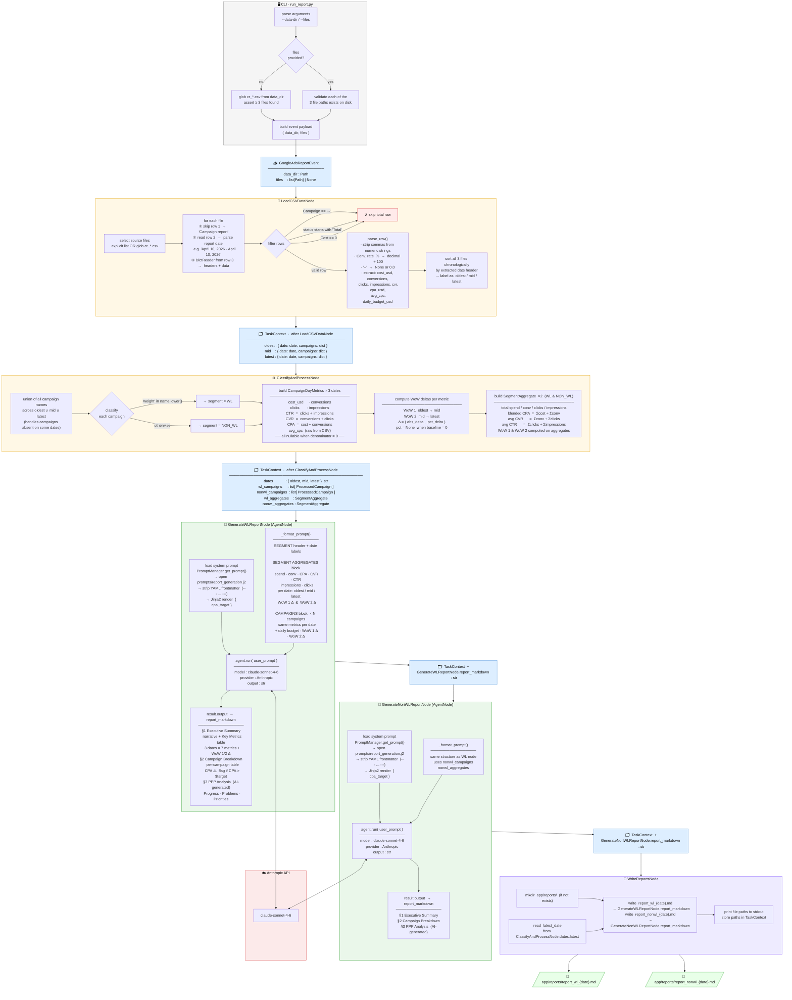

# Google Ads Assistant — Workflow Architecture

This document describes the end-to-end pipeline that runs when you execute `python app/run_report.py`.

---



---

## Node Reference

| Node | Type | Input | Output |
|---|---|---|---|
| `LoadCSVDataNode` | `Node` | `GoogleAdsReportEvent` (data_dir, files) | `{ oldest, mid, latest }` with date + campaign rows |
| `ClassifyAndProcessNode` | `Node` | Raw campaign dicts × 3 dates | `ProcessedCampaign[]` per segment, `SegmentAggregate` × 2, dates |
| `GenerateWLReportNode` | `AgentNode` | WL campaigns + aggregates + dates | `report_markdown: str` |
| `GenerateNonWLReportNode` | `AgentNode` | Non-WL campaigns + aggregates + dates | `report_markdown: str` |
| `WriteReportsNode` | `Node` | Both report markdown strings | Written `.md` files + paths stored in TaskContext |

## Data Models

```
CampaignDayMetrics        WoWDeltas                  ProcessedCampaign
─────────────────         ─────────────────          ─────────────────────────
cost_usd    : float       cost_usd     : Delta       name             : str
conversions : float       conversions  : Delta       segment          : WL | NON_WL
clicks      : int         clicks       : Delta       daily_budget_usd : float
impressions : int         impressions  : Delta       date_oldest      : CampaignDayMetrics
ctr         : float?      ctr          : Delta       date_mid         : CampaignDayMetrics
cvr         : float?      cvr          : Delta       date_latest      : CampaignDayMetrics
cpa_usd     : float?      cpa_usd      : Delta       wow1             : WoWDeltas
avg_cpc     : float?                                 wow2             : WoWDeltas

Delta = ( abs_delta: float | None,  pct_delta: float | None )
```

## Running the Pipeline

```bash
# Auto-select 3 most recent CSVs from app/data/
python app/run_report.py

# Specify exact files (e.g. Thursday data)
python app/run_report.py --files app/data/cr_09_04.csv app/data/cr_16_04.csv app/data/cr_23_04.csv
```

## Report Structure

Each generated report contains:

1. **Executive Summary** — narrative overview + key metrics table across 3 dates with WoW 1 and WoW 2 deltas
2. **Campaign Breakdown** — per-campaign metrics table; CPA flagged with ⚠️ where it exceeds the target
3. **PPP Analysis** *(AI-generated)* — Progress, Problems, and Priorities with specific, actionable recommendations

> ⚠️ All AI-generated recommendations require human review. No automated actions are taken.
